# E-speak — How the Website Works (Sequence Diagrams)

> These diagrams show the step-by-step journey of different actions on the E-speak platform.
> Think of each arrow as a "conversation" between you (the user), the website screen, and the server storing data.

---

## 1. Visiting the Home Page

When anyone opens the website, the home page loads live statistics from the server.

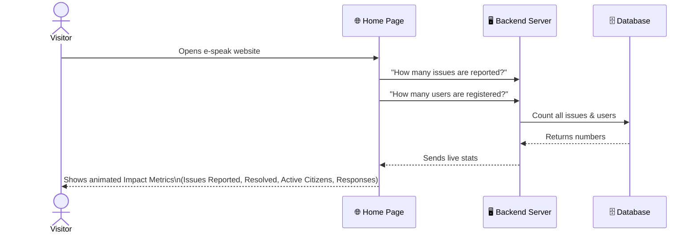

---

## 2. User Registration (Creating an Account)

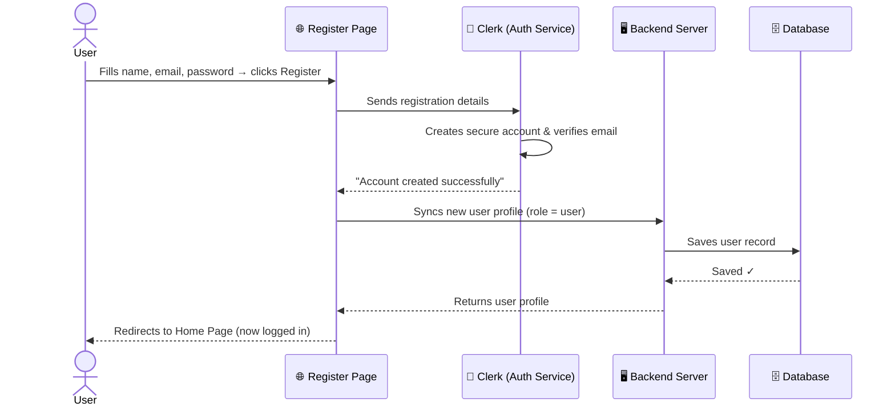

---

## 3. User Login (Signing In)

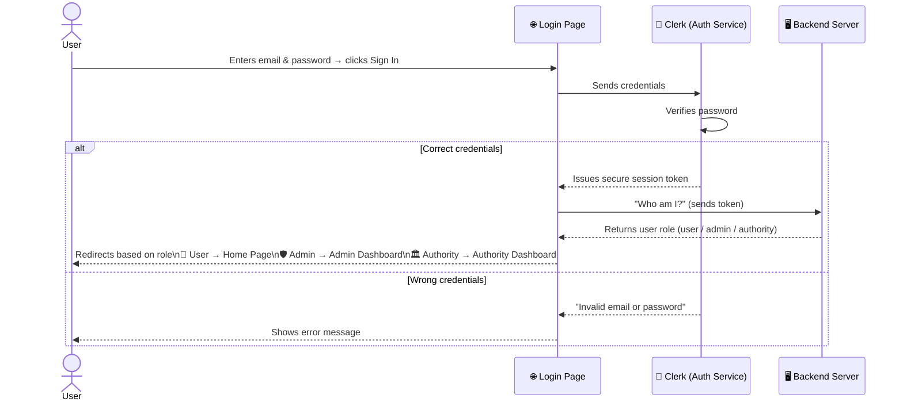

---

## 4. Reporting a Civic Issue

This is the main feature — a citizen reporting a problem in their community.

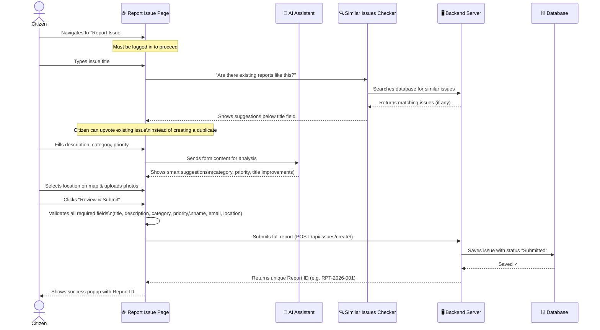

---

## 5. Browsing & Viewing Issues

Any visitor (even without an account) can browse all reported issues.

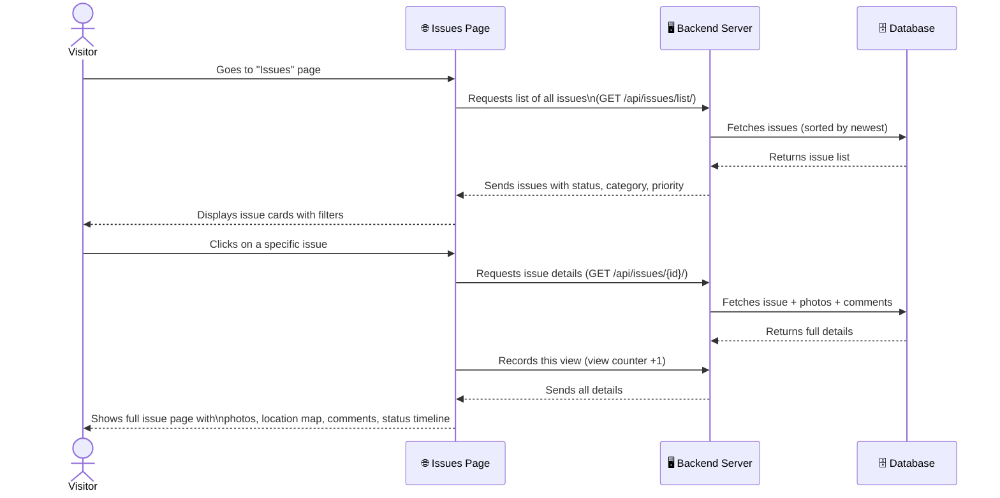

---

## 6. Upvoting an Issue

Citizens can support an existing issue to push it up in priority.

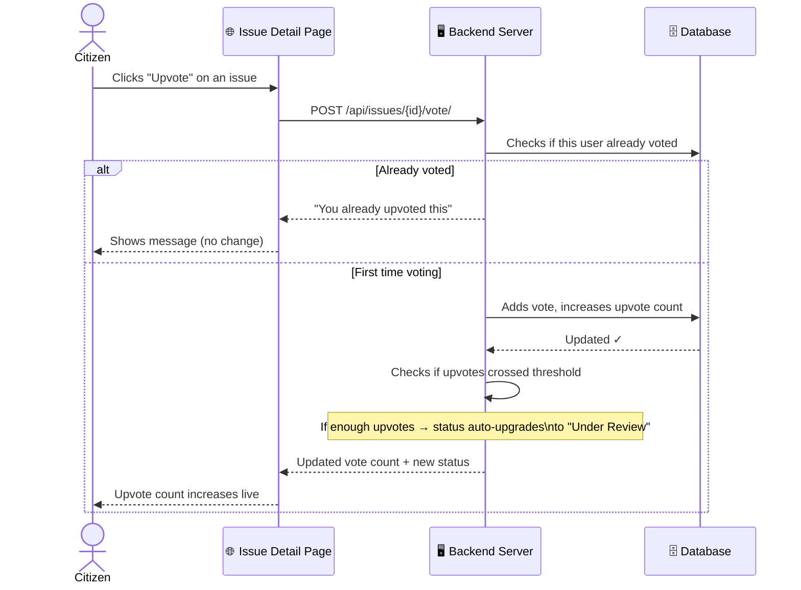

---

## 7. Admin Managing the Platform

Admins can see all users, change roles, and oversee all reported issues.

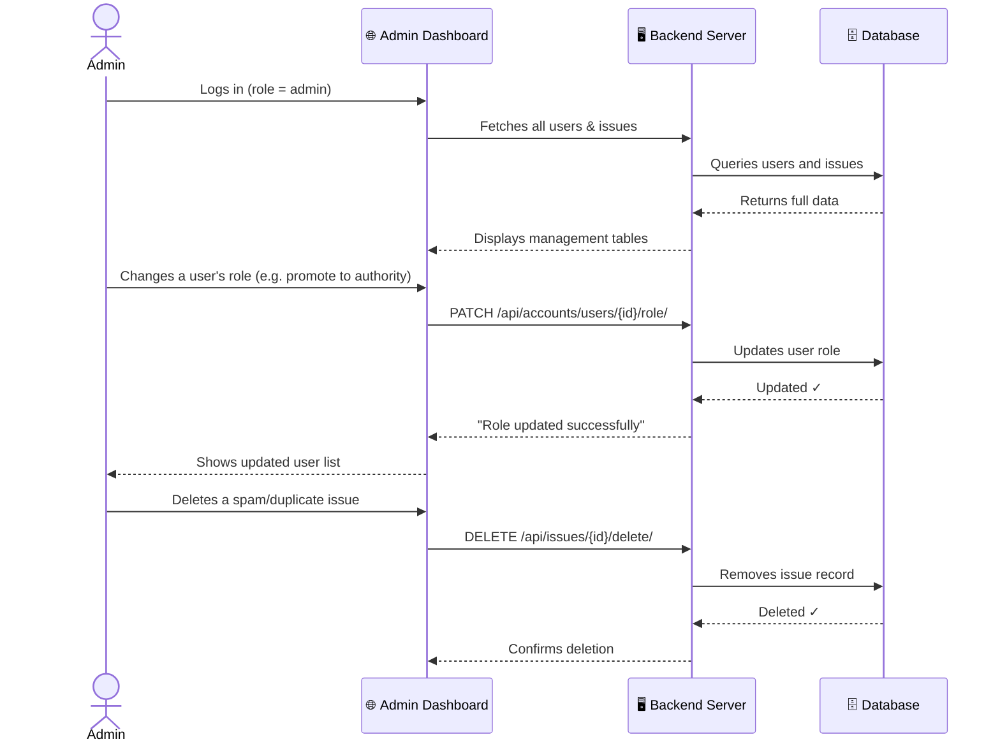

---

## 8. Authority Resolving an Issue

Authority members handle assigned issues and update their status.

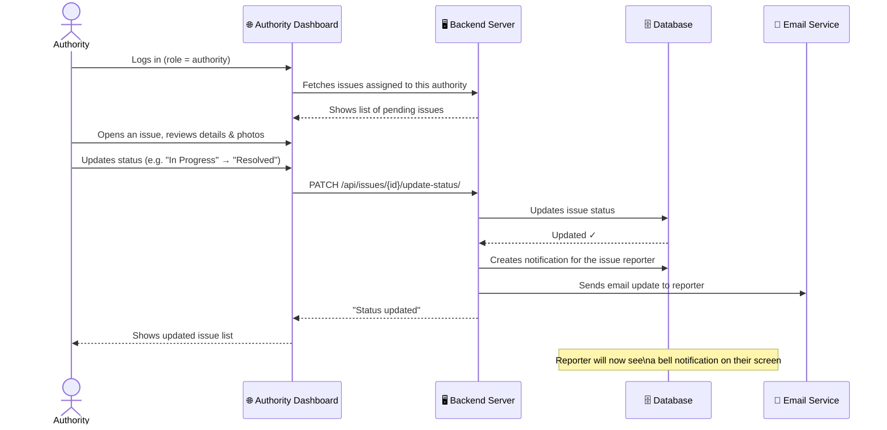

---

## 9. Receiving a Status Notification

When an issue is updated, the person who reported it gets notified automatically.

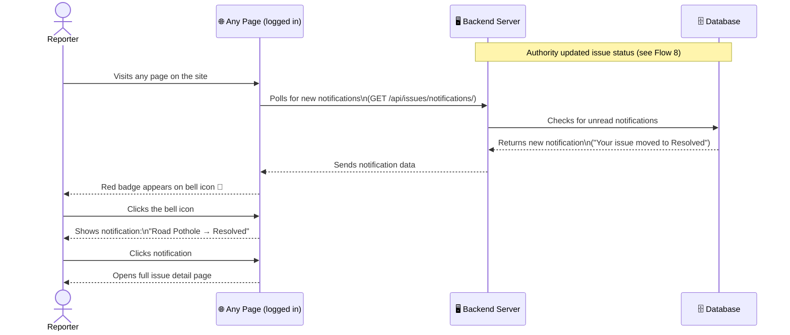

---

## 10. Using the AI Civic Assistant (Chat)

The AI assistant helps users understand how civic issues are typically handled.

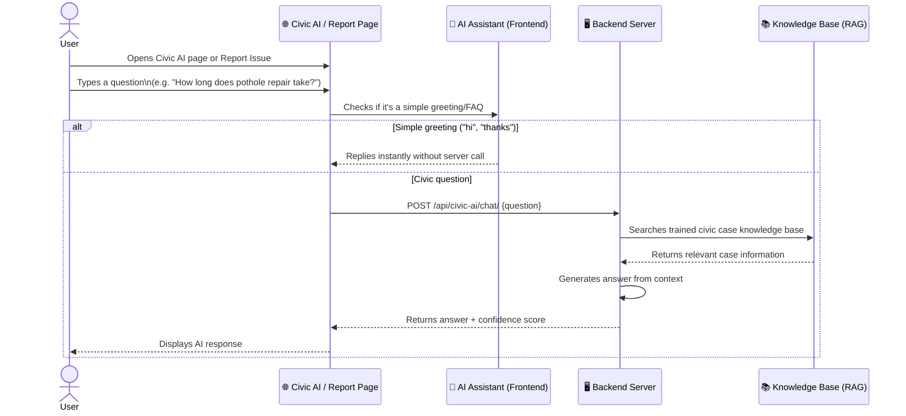

---

## 11. Map View

Users can see all reported issues plotted on an interactive map.

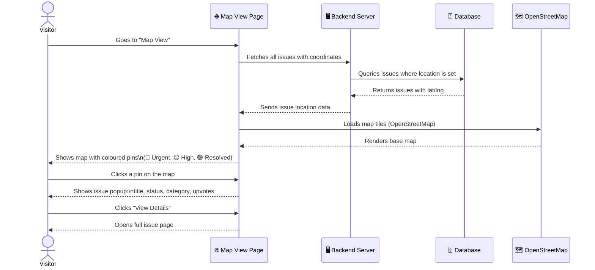

---

## Overall System Architecture (Quick View)

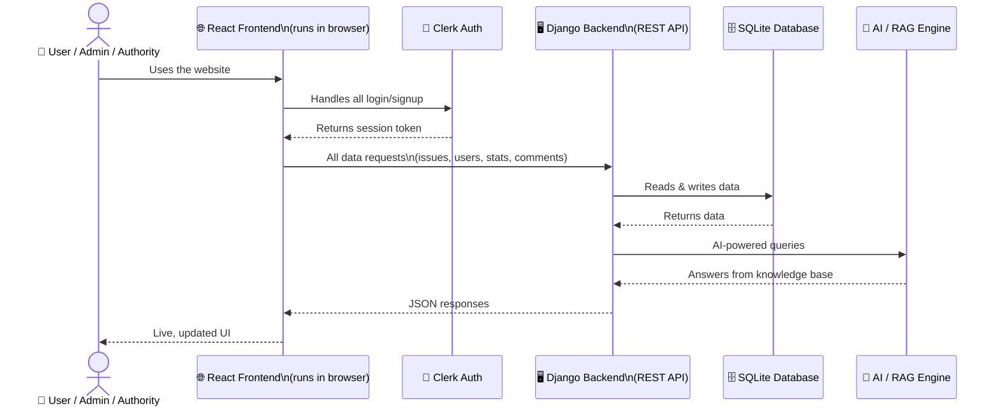

---

*Generated for E-speak Civic Platform — Empowering Voices, Developing Communities.*
